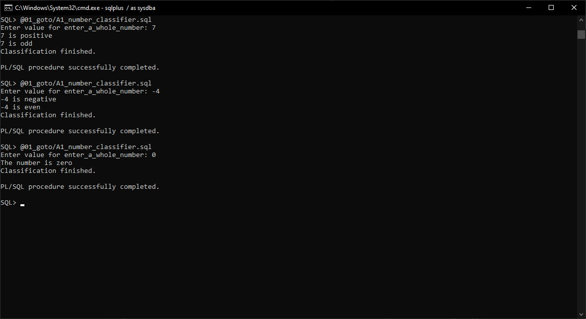
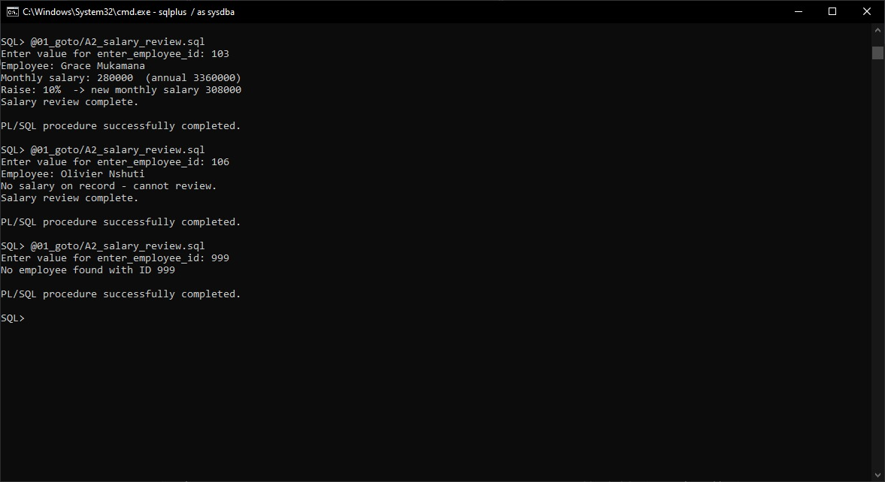
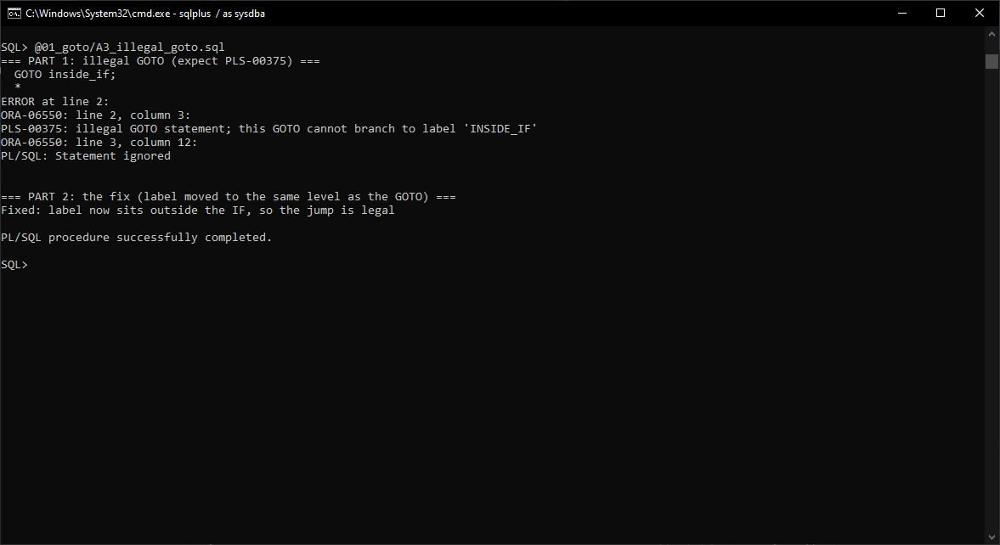
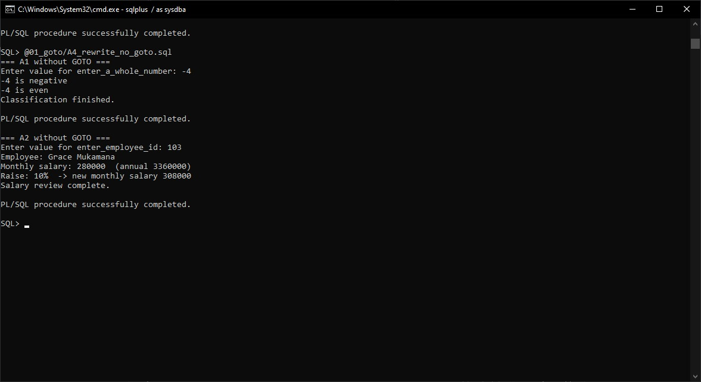
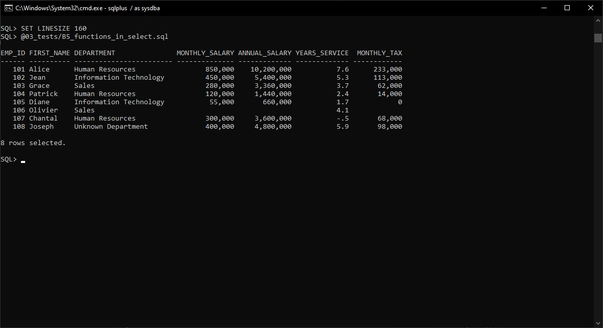
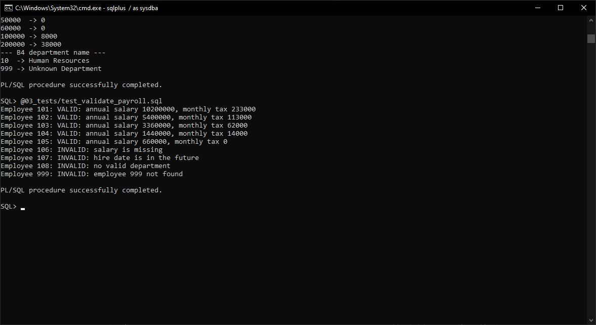

# PL/SQL GOTO and Functions

INSY 8311, Individual Assignment III
Axel, ID 29273

Done on Oracle 21c XE using SQL*Plus.

## Folders

- `00_setup` creates the tables and sample data
- `01_goto` has A1 to A4
- `02_functions` has B1 to B4 and C1
- `03_tests` has the B5 select and the test files
- `screenshots` has the outputs
- `docs` has the reflection

## How to run

1. `@00_setup/create_tables.sql`
2. Functions in `02_functions`, with C1 last since it uses the others
3. Programs in `01_goto` (A1 and A2 ask you to type a value)
4. Files in `03_tests`

I run `SET SERVEROUTPUT ON` first so the output shows.

## Tables

`departments` and `employees`. Salary is monthly in RWF. Employees 106, 107 and 108 have bad data on purpose (no salary, future hire date, no department) so C1 has something to catch.

## Part A: GOTO

**A1:** You type a number and it uses GOTO to say if it is positive, negative or zero, then even or odd.

**A2:** You type an employee ID and it jumps to a low, mid or high salary section for the raise. No salary jumps to a message instead.

**A3:** I jumped into the middle of an IF block and Oracle gave `PLS-00375: illegal GOTO`. I fixed it by putting the label outside the IF.

**A4:** A1 and A2 again but with IF / ELSIF and no GOTO.

## Part B: Functions

- `fn_annual_salary` gives salary x 12
- `fn_years_of_service` gives years since the hire date
- `fn_calculate_tax` gives tax from brackets (0% up to 60,000, 20% up to 100,000, 30% above)
- `fn_dept_name` gives the department name, or `Unknown Department` if not found

**B5:** all of them used inside one SELECT.

## Part C

**C1:** `fn_validate_payroll` checks an employee and says VALID or what is wrong. It handles employee not found with an exception.

**C2:** see [docs/REFLECTION.md](docs/REFLECTION.md)

## Notes (AI use)

I used Claude (AI) to generate the test data in `00_setup/create_tables.sql` and to help write and debug the SQL files. I went through everything and I can explain it.
